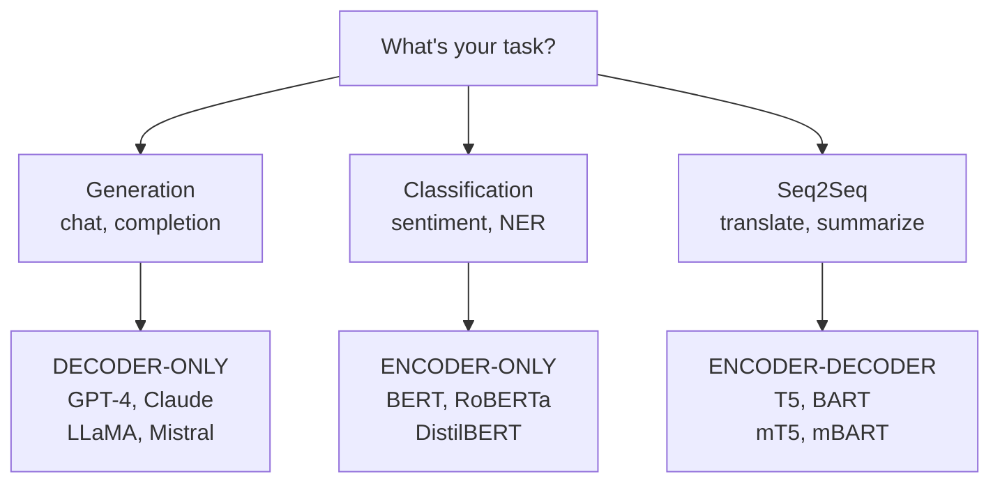

The original Transformer from 2017 had 65M parameters and a 512 token context. GPT-4 reportedly has 1.7T parameters and handles 128K tokens. Same architecture? Mostly. The core attention mechanism is identical. What changed are the components around it: how we encode position, how we normalize activations, and how we avoid the O(n²) attention wall.

This post covers the specific modifications that make modern transformers work at scale, with code you can run and numbers you can verify.

## What We're Covering

```
┌─────────────────────────────────────────────────────────────────┐
│ TRANSFORMER MODIFICATIONS                                       │
├─────────────────────────────────────────────────────────────────┤
│ 1. Position Embeddings  2. Layer Norm      3. Attention        │
│    ├─ Learned              ├─ Post → Pre      ├─ Full → Sparse │
│    ├─ Sinusoidal           └─ LayerNorm       ├─ MHA → GQA     │
│    ├─ ALiBi                  → RMSNorm        └─ Sliding Win   │
│    └─ RoPE (modern std)                                         │
├─────────────────────────────────────────────────────────────────┤
│ 4. Architecture Types   5. BERT Deep Dive                       │
│    ├─ Encoder-Decoder      ├─ MLM + NSP                         │
│    ├─ Encoder-Only (BERT)  ├─ Fine-tuning                       │
│    └─ Decoder-Only (GPT)   └─ DistilBERT, RoBERTa              │
└─────────────────────────────────────────────────────────────────┘
```

## 30-Second Attention Recap

Every token computes attention to every other token:

```
Attention(Q, K, V) = softmax(QK^T / √d_k) × V
```

For a sequence of n=4096 tokens with d=128 dimensions per head:

- **QK^T matrix**: 4096 × 4096 = 16.7M elements
- **Memory per head (fp16)**: 16.7M × 2 bytes = 33.5 MB
- **With 32 heads**: 1.07 GB just for attention scores

This O(n²) scaling is why context length was stuck at 2K-4K for years. We'll see how sparse attention and sliding windows break this limit.

## Position Embeddings: Four Generations

Transformers process all tokens in parallel—no inherent notion of order. Without position encoding, "dog bites man" = "man bites dog". Here's how we went from learned embeddings to RoPE.

| Method      | Where Applied      | Extrapolation      | Used By              |
|-------------|--------------------|--------------------|----------------------|
| Learned     | Input embeddings   | None               | BERT, GPT-2          |
| Sinusoidal  | Input embeddings   | Theoretical (poor) | Original Transformer |
| ALiBi       | Attention bias     | Excellent          | BLOOM, MPT           |
| RoPE        | Q/K rotation       | Good (with scaling)| LLaMA, Mistral, Qwen |

### Method 1: Learned Position Embeddings

Create a learnable embedding matrix of shape `(max_seq_len, d_model)`. Add position embedding to token embedding.

```python
# pytorch implementation
class LearnedPositionEmbedding(nn.Module):
    def __init__(self, max_seq_len=512, d_model=768):
        super().__init__()
        self.pos_embed = nn.Embedding(max_seq_len, d_model)

    def forward(self, x):
        seq_len = x.size(1)
        positions = torch.arange(seq_len, device=x.device)
        return x + self.pos_embed(positions)
```

**Problem**: Can't extrapolate beyond `max_seq_len`. Train on 512 tokens? Position 513 has no learned embedding.

### Method 2: Sinusoidal Embeddings

Use predetermined sine/cosine waves at different frequencies. No learning required.

```
PE(pos, 2i)   = sin(pos / 10000^(2i/d_model))
PE(pos, 2i+1) = cos(pos / 10000^(2i/d_model))
```

**Key insight**: The dot product of position embeddings at positions m and n simplifies to a sum of cosines depending only on (m-n). Closer positions → higher similarity.

```python
# numpy implementation
def sinusoidal_embeddings(max_len, d_model):
    pe = np.zeros((max_len, d_model))
    position = np.arange(max_len)[:, np.newaxis]
    div_term = np.exp(np.arange(0, d_model, 2) * -(np.log(10000.0) / d_model))

    pe[:, 0::2] = np.sin(position * div_term)
    pe[:, 1::2] = np.cos(position * div_term)
    return pe
```

**Advantage**: Can extrapolate to unseen lengths.
**Disadvantage**: Position info added at input, not where attention happens.

### Method 3: ALiBi (Attention with Linear Biases)

Instead of modifying inputs, add a bias directly inside the attention computation:

```
softmax(QK^T / √d + bias_matrix)
```

The bias is simply `-m × |i - j|` where `m` is a head-specific slope. Linear penalty for distance.

```python
# alibi bias computation
def get_alibi_bias(seq_len, num_heads):
    # slopes: 2^(-8/num_heads), 2^(-16/num_heads), ...
    slopes = 2 ** (-8 * torch.arange(1, num_heads + 1) / num_heads)
    positions = torch.arange(seq_len)
    bias = -slopes[:, None, None] * torch.abs(
        positions[None, :, None] - positions[None, None, :])
    return bias  # (num_heads, seq_len, seq_len)
```

**Used by**: BLOOM (176B), MPT-7B/30B

### Method 4: RoPE (Rotary Position Embeddings) — The Modern Standard

Rotate query and key vectors by angles proportional to position. When you compute Q·K^T, the result depends only on relative position (m-n).

**Math intuition**: In 2D, rotating vector v by angle θ uses a rotation matrix:

```
R(θ) = [[cos(θ), -sin(θ)],
        [sin(θ),  cos(θ)]]
```

Rotate Q by θ×m and K by θ×n. The dot product Q_rotated · K_rotated contains cos(θ×(m-n))—relative position encoded automatically.

```python
# rope implementation (simplified)
def apply_rope(x, positions, theta=10000.0):
    d = x.shape[-1]
    freqs = 1.0 / (theta ** (torch.arange(0, d, 2) / d))
    angles = positions[:, None] * freqs[None, :]
    cos, sin = torch.cos(angles), torch.sin(angles)

    x1, x2 = x[..., ::2], x[..., 1::2]
    return torch.stack([x1*cos - x2*sin, x1*sin + x2*cos],
                       dim=-1).flatten(-2)
```

**Used by**: LLaMA, LLaMA-2, Mistral, Qwen, Phi, Yi—basically every modern open-source LLM.

> **⚠ RoPE Extrapolation Warning**: RoPE trained at 4K context doesn't automatically work at 32K. You need techniques like YaRN or NTK-aware scaling to extend context. Don't assume position embeddings generalize to longer sequences without explicit extension methods.

## Layer Normalization: From Post-Norm to RMSNorm

The "Add & Norm" boxes in transformer diagrams hide important details. Here's what changed and why.

### What LayerNorm Does

Normalize each activation vector to zero mean, unit variance:

```
LayerNorm(x) = γ × (x - μ) / σ + β
```

where μ = mean(x), σ = std(x), and γ, β are learnable (shape = d_model).

**Why not BatchNorm?** BatchNorm normalizes across the batch dimension, creating dependencies between samples. At inference with batch_size=1, BatchNorm uses running statistics which don't match training. LayerNorm operates per-sample, per-position—no batch dependency.

### Post-Norm vs Pre-Norm

```
POST-NORM (Original 2017)     PRE-NORM (Modern)
─────────────────────────     ─────────────────────

        x                             x
        │                             │
        ▼                      ├───────────┐
   ┌─────────┐                 ▼           │
   │ Sublayer│            ┌─────────┐      │
   └────┬────┘            │LayerNorm│      │
        │                 └────┬────┘      │
    +  ←── x (residual)        ▼           │
        │                 ┌─────────┐      │
        ▼                 │ Sublayer│      │
   ┌─────────┐            └────┬────┘      │
   │LayerNorm│                 │           │
   └────┬────┘             +  ←────────────┘
        ▼                      │
      output                   ▼
                             output
```

**Post-Norm**: LayerNorm(x + Sublayer(x))
**Pre-Norm**: x + Sublayer(LayerNorm(x))

**Why Pre-Norm wins**: Gradients flow more directly through residual connections. Training is more stable for deep networks (24+ layers). All modern LLMs use Pre-Norm.

### RMSNorm: Simpler and Faster

Drop the mean subtraction, drop β. Just scale by RMS:

```
RMSNorm(x) = γ × x / RMS(x)
RMS(x) = sqrt(mean(x²))
```

```python
# rmsnorm implementation
class RMSNorm(nn.Module):
    def __init__(self, d_model, eps=1e-6):
        super().__init__()
        self.weight = nn.Parameter(torch.ones(d_model))
        self.eps = eps

    def forward(self, x):
        rms = torch.sqrt(torch.mean(x ** 2, dim=-1, keepdim=True) + self.eps)
        return self.weight * (x / rms)
```

**Savings**: ~50% fewer parameters in norm layers (no β). Slight speedup. Same performance.
**Used by**: LLaMA, Mistral, Qwen.

## Attention Variations: Breaking O(n²)

Two orthogonal optimizations: (1) sparse attention patterns, (2) sharing key/value projections.

### Sliding Window Attention

Each token only attends to w neighbors. Complexity drops from O(n²) to O(n×w).

```
Full Attention (n=8)         Sliding Window (w=3)
────────────────────         ────────────────────
    t1 t2 t3 t4 t5 t6 t7 t8      t1 t2 t3 t4 t5 t6 t7 t8
t1  ■  ■  ■  ■  ■  ■  ■  ■  t1  ■  ■  ·  ·  ·  ·  ·  ·
t2  ■  ■  ■  ■  ■  ■  ■  ■  t2  ■  ■  ■  ·  ·  ·  ·  ·
t3  ■  ■  ■  ■  ■  ■  ■  ■  t3  ■  ■  ■  ■  ·  ·  ·  ·
t4  ■  ■  ■  ■  ■  ■  ■  ■  t4  ·  ■  ■  ■  ■  ·  ·  ·
t5  ■  ■  ■  ■  ■  ■  ■  ■  t5  ·  ·  ■  ■  ■  ■  ·  ·
t6  ■  ■  ■  ■  ■  ■  ■  ■  t6  ·  ·  ·  ■  ■  ■  ■  ·
t7  ■  ■  ■  ■  ■  ■  ■  ■  t7  ·  ·  ·  ·  ■  ■  ■  ■
t8  ■  ■  ■  ■  ■  ■  ■  ■  t8  ·  ·  ·  ·  ·  ■  ■  ■

■ = attention computed          ■ = attention computed
64 computations                 24 computations
```

**Effective receptive field**: With L layers and window w, a token can aggregate information from L×w positions. Mistral-7B uses w=4096 across 32 layers → effective context of 131K tokens per forward pass.

Modern architectures interleave local (sliding window) and global attention layers.

### MHA → GQA → MQA: Sharing Key/Value Heads

During autoregressive decoding, you recompute attention for every new token. The KV cache stores past keys/values to avoid recomputation. Sharing K/V projections shrinks this cache.

| Type | KV Heads      | Cache Size       | Example (32 Q heads)  |
|------|---------------|------------------|-----------------------|
| MHA  | = Q heads     | Baseline         | 32 KV heads           |
| GQA  | Q / group_size| ÷ group_size     | 8 KV heads (4x smaller)|
| MQA  | 1             | ÷ Q heads        | 1 KV head (32x smaller)|

```
MHA (h=8)        GQA (h=8, g=2)    MQA (h=8, g=1)
─────────        ──────────────    ──────────────
Q: ████████      Q: ████████       Q: ████████
K: ████████      K: ██             K: █
V: ████████      V: ██             V: █

8 Q, 8 K, 8 V    8 Q, 2 K, 2 V     8 Q, 1 K, 1 V
```

**Why keep Q diverse but share K/V?** Each new token needs fresh queries ("what am I looking for?"). But the keys/values for past tokens stay constant—they're what gets cached and reused thousands of times during generation.

**Used by**: LLaMA-2 70B uses GQA (8 KV heads for 64 query heads). Falcon-40B uses MQA.

## Three Transformer Architectures

```
ENCODER-DECODER      ENCODER-ONLY       DECODER-ONLY
(T5, BART)           (BERT, RoBERTa)    (GPT, LLaMA, Mistral)
──────────────────   ──────────────     ──────────────────

   ┌─────────┐       ┌─────────┐        ┌─────────┐
   │ ENCODER │──┐    │ ENCODER │        │ DECODER │
   └─────────┘  │    └────┬────┘        │ (causal │
                │         │              │  mask)  │
                │         ▼              └────┬────┘
                │   [CLS] embed               │
                │         │                   │
   ┌─────────┐ │         ▼                   ▼
   │ DECODER │ │   Classification      Next token
   │ (cross- │ │
   │  attn)  │ │
   └────┬────┘ │
        │      │
        ▼      ▼
  Output sequence
```

| Type            | Attention           | Use Case              | Examples        |
|-----------------|---------------------|-----------------------|-----------------|
| Encoder-Only    | Bidirectional       | Classification, NER   | BERT, RoBERTa   |
| Decoder-Only    | Causal (masked)     | Generation, chat      | GPT-4, LLaMA    |
| Encoder-Decoder | Bi + Cross + Causal | Translation, summary  | T5, BART        |

**Why decoder-only dominates**: Next-token prediction is dead simple, scales with compute, and matches the chat/completion use case. The encoder's bidirectional context is nice for classification but unnecessary for generation.

## BERT: The Encoder-Only Paradigm

**BERT** = **B**idirectional **E**ncoder **R**epresentations from **T**ransformers. Dropped the decoder. Uses masked language modeling instead of next-token prediction. Still widely used for classification (sentiment, NER, embeddings).

### BERT Input Format

```
[CLS] this teddy bear is cute [SEP] it is fluffy [SEP] [PAD] [PAD]
```

Three embeddings summed:

1. **Token embeddings**: WordPiece vocabulary (~30K tokens)
2. **Position embeddings**: Learned, max 512 positions
3. **Segment embeddings**: Just 2 learned vectors—Segment A or Segment B. Same embedding for all tokens in a segment.

```python
# bert input processing
input_ids:       [101, 2023, 11947, 4562, 2003, 10140, 102, 2009, ...]
token_type_ids:  [  0,    0,     0,    0,    0,     0,   0,    1, ...]  # segment A=0, B=1
attention_mask:  [  1,    1,     1,    1,    1,     1,   1,    1, ...]  # 1=real, 0=pad
```

### Pre-training: MLM + NSP

**Masked Language Modeling (MLM)**: Randomly mask 15% of tokens. Of those:

- 80%: Replace with `[MASK]`
- 10%: Replace with random token
- 10%: Keep original

Predict original tokens from context. Forces bidirectional understanding.

**Next Sentence Prediction (NSP)**: Given two sentences, predict if B follows A (50/50 real/random). *Spoiler*: later research (RoBERTa) shows this doesn't help.

### Fine-tuning for Classification

```python
# huggingface example - sentiment classification
from transformers import BertForSequenceClassification, BertTokenizer

model = BertForSequenceClassification.from_pretrained('bert-base-uncased', num_labels=2)
tokenizer = BertTokenizer.from_pretrained('bert-base-uncased')

inputs = tokenizer('This movie is great!', return_tensors='pt')
outputs = model(**inputs)
logits = outputs.logits  # shape: (1, 2) for binary classification
```

The `[CLS]` token embedding (position 0) is fed through a linear layer → class logits. All tokens attended to all tokens (bidirectional), so `[CLS]` captures full context.

### BERT Variants: What Changed

| Model        | Params | Layers | GLUE Avg | Speed |
|--------------|--------|--------|----------|-------|
| BERT-base    | 110M   | 12     | 79.6     | 1x    |
| DistilBERT   | 66M    | 6      | 77.0     | 1.6x  |
| RoBERTa-base | 125M   | 12     | 83.2     | 1x    |

#### DistilBERT: Knowledge Distillation

Train a smaller "student" to mimic a larger "teacher". Key insight: the teacher's soft probability distribution contains more signal than hard labels.

If BERT predicts `[0.7 positive, 0.2 neutral, 0.1 negative]`, that's richer supervision than just "positive". Use KL divergence to match distributions:

```
L_distill = KL(softmax(teacher_logits/T), softmax(student_logits/T))
```

where T is temperature (T>1 softens distributions).

**Result**: 6 layers vs 12, 66M params vs 110M, 60% faster, retains ~97% of BERT's performance on GLUE.

#### RoBERTa: Training Done Right

Questioned BERT's design choices:

1. **Drop NSP**: No benefit found. Just use MLM.
2. **Dynamic masking**: Re-mask each epoch instead of fixed masks during preprocessing.
3. **More data, longer training**: BERT was undertrained. 160GB text + 500K steps beats 16GB + 100K steps.
4. **Larger batches**: 8K batch size vs 256.

**Result**: Same architecture, same parameter count, but beats BERT-large on all benchmarks.

## Decision Framework: When to Use What



### Position Embedding Selection

- **Need long context (>8K)?** → RoPE with NTK/YaRN scaling
- **Length extrapolation critical?** → ALiBi
- **Fixed short context (<512)?** → Learned embeddings are fine

### Attention Head Sharing

- **Inference latency critical + long sequences?** → GQA or MQA
- **Batch inference (high throughput)?** → MHA is fine, KV cache amortizes
- **Memory constrained?** → MQA gives maximum KV cache savings

## Quick Reference

| Component      | 2017 (Original)         | 2024 (Modern)              |
|----------------|-------------------------|----------------------------|
| Position       | Sinusoidal / Learned    | RoPE                       |
| Normalization  | Post-Norm + LayerNorm   | Pre-Norm + RMSNorm         |
| Attention      | Full MHA                | GQA + Sliding Window       |
| Architecture   | Encoder-Decoder         | Decoder-Only               |
| Context        | 512 tokens              | 128K+ tokens               |

## Implementation Checklist

- ☐ **Position embeddings**: RoPE for generation, learned for classification
- ☐ **Normalization**: Pre-norm + RMSNorm (not post-norm + LayerNorm)
- ☐ **Attention**: GQA if KV cache matters, full MHA otherwise
- ☐ **Architecture**: Decoder-only for generation, BERT for classification
- ☐ **BERT fine-tuning**: RoBERTa > BERT; DistilBERT if latency matters

## Papers

- [Attention Is All You Need](https://arxiv.org/abs/1706.03762) (Vaswani 2017) — Original transformer
- [BERT](https://arxiv.org/abs/1810.04805) (Devlin 2019) — Encoder-only pre-training
- [RoBERTa](https://arxiv.org/abs/1907.11692) (Liu 2019) — BERT done right
- [DistilBERT](https://arxiv.org/abs/1910.01108) (Sanh 2019) — Knowledge distillation
- [RoFormer](https://arxiv.org/abs/2104.09864) (Su 2021) — RoPE
- [Train Short, Test Long](https://arxiv.org/abs/2108.12409) (Press 2022) — ALiBi
- [GQA](https://arxiv.org/abs/2305.13245) (Ainslie 2023) — Grouped-query attention
