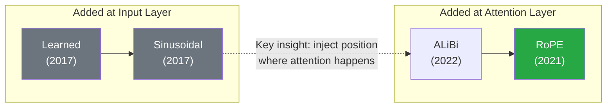
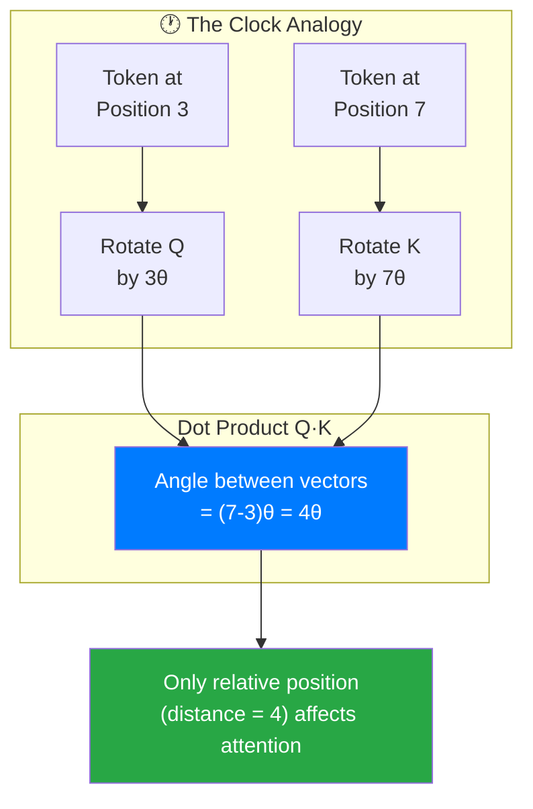
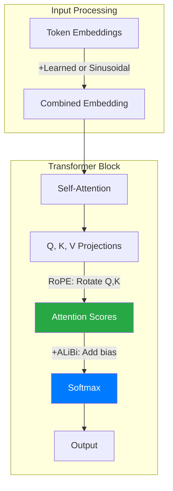
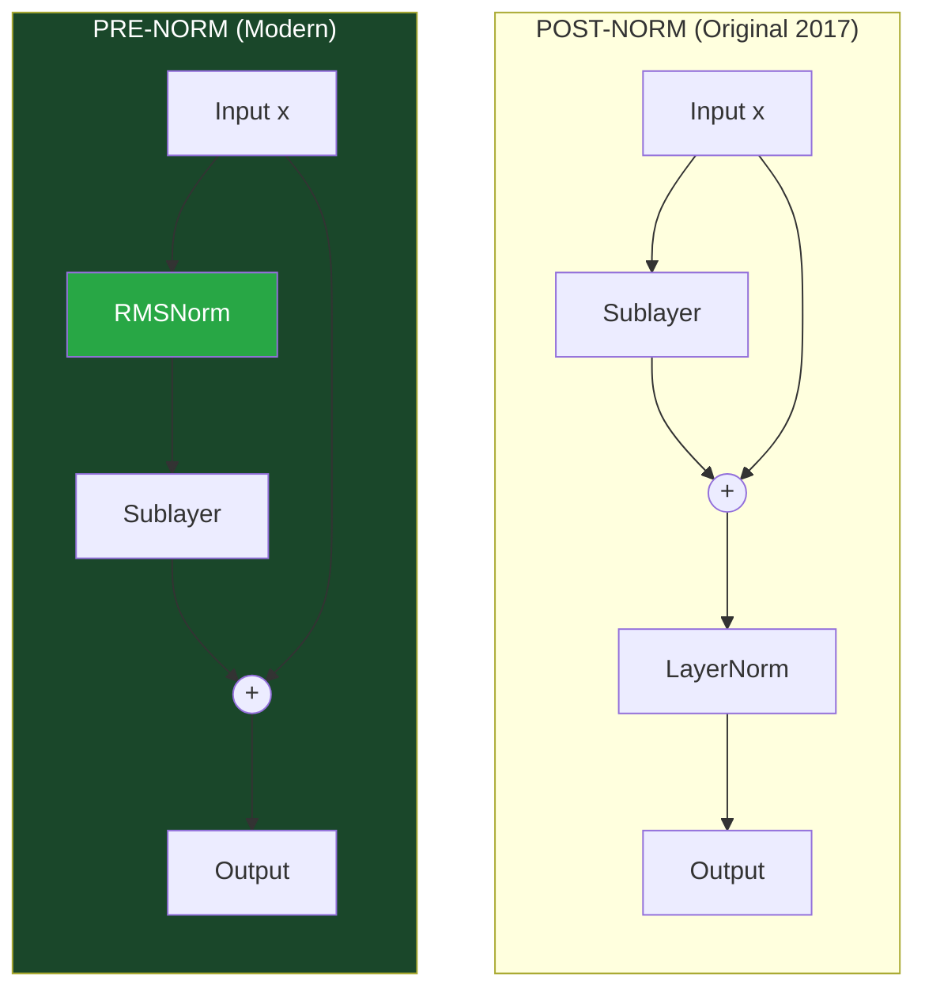
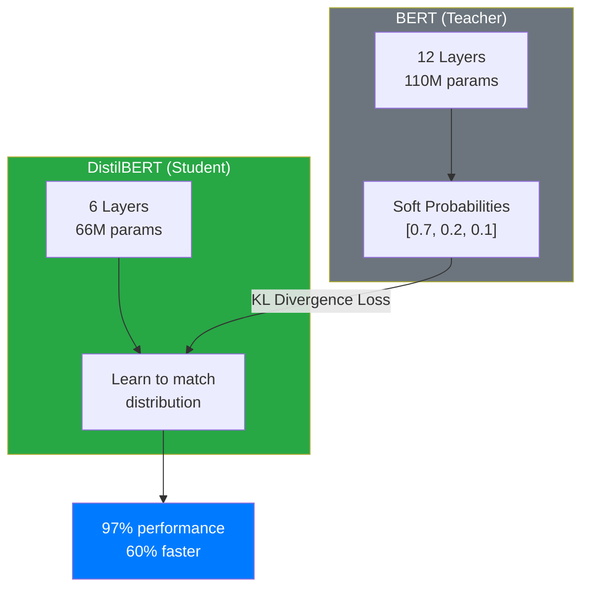
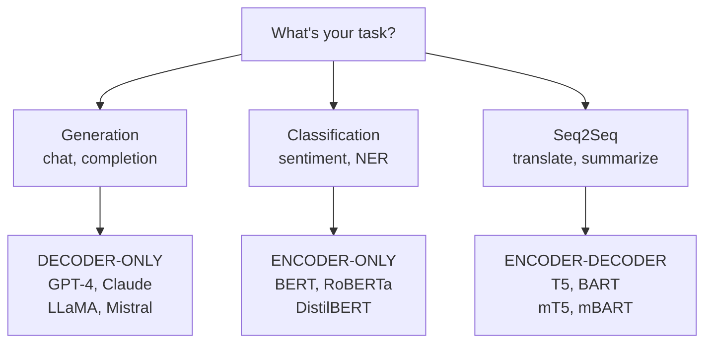
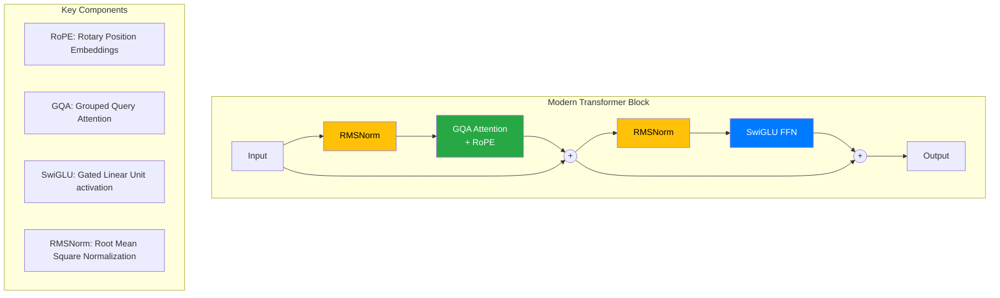

The original Transformer from 2017 had 65M parameters and a 512 token context. GPT-4 reportedly has 1.7T parameters and handles 128K tokens. Same architecture? Mostly. The core attention mechanism is identical. What changed are the components around it: how we encode position, how we normalize activations, and how we avoid the O(n²) attention wall.

This post covers the specific modifications that make modern transformers work at scale, with code you can run and numbers you can verify. It also includes the 2024-2025 refinements (MLA, MoE, QK-Norm, and NoPE) that are showing up in flagship open models.


## What We're Covering

```
┌─────────────────────────────────────────────────────────────────┐
│ TRANSFORMER MODIFICATIONS                                       │
├─────────────────────────────────────────────────────────────────┤
│ 1. Position Embeddings  2. Layer Norm      3. Attention        │
│    ├─ Learned              ├─ Post → Pre      ├─ Full → Sparse │
│    ├─ Sinusoidal           └─ LayerNorm       ├─ MHA → GQA     │
│    ├─ ALiBi                  → RMSNorm        └─ Sliding Win   │
│    └─ RoPE (modern std)                                         │
├─────────────────────────────────────────────────────────────────┤
│ 4. Architecture Types   5. BERT Deep Dive                       │
│    ├─ Encoder-Decoder      ├─ MLM + NSP                         │
│    ├─ Encoder-Only (BERT)  ├─ Fine-tuning                       │
│    └─ Decoder-Only (GPT)   └─ DistilBERT, RoBERTa              │
└─────────────────────────────────────────────────────────────────┘
```

## 30-Second Attention Recap

Every token computes attention to every other token. Quick reminder: **Q** (query) = "what am I looking for?", **K** (key) = "what do I contain?", **V** (value) = "what do I output if matched?".

```
Attention(Q, K, V) = softmax(QK^T / √d_k) × V
```

For a sequence of n=4096 tokens with d=128 dimensions per head:

- **QK^T matrix**: 4096 × 4096 = 16.7M elements
- **Memory per head (fp16)**: 16.7M × 2 bytes = 33.5 MB
- **With 32 heads**: 1.07 GB just for attention scores

This O(n²) scaling is why context length was stuck at 2K-4K for years. We'll see how sparse attention and sliding windows break this limit.

## Position Embeddings: Four Generations

Transformers process all tokens in parallel—no inherent notion of order. Without position encoding, "dog bites man" = "man bites dog". Here's how we went from learned embeddings to RoPE.

| Method      | Where Applied      | Extrapolation      | Used By              |
|-------------|--------------------|--------------------|----------------------|
| Learned     | Input embeddings   | None               | BERT, GPT-2          |
| Sinusoidal  | Input embeddings   | Theoretical (poor) | Original Transformer |
| ALiBi       | Attention bias     | Excellent          | BLOOM, MPT           |
| RoPE        | Q/K rotation       | Good (with scaling)| LLaMA, Mistral, Qwen |



### Method 1: Learned Position Embeddings

Create a learnable embedding matrix of shape `(max_seq_len, d_model)`. Add position embedding to token embedding.

```python
# pytorch implementation
class LearnedPositionEmbedding(nn.Module):
    def __init__(self, max_seq_len=512, d_model=768):
        super().__init__()
        self.pos_embed = nn.Embedding(max_seq_len, d_model)

    def forward(self, x):
        seq_len = x.size(1)
        positions = torch.arange(seq_len, device=x.device)
        return x + self.pos_embed(positions)
```

**Problem**: Can't extrapolate beyond `max_seq_len`. Train on 512 tokens? Position 513 has no learned embedding.

### Method 2: Sinusoidal Embeddings

Use predetermined sine/cosine waves at different frequencies. No learning required.

```
PE(pos, 2i)   = sin(pos / 10000^(2i/d_model))
PE(pos, 2i+1) = cos(pos / 10000^(2i/d_model))
```

**Key insight**: The dot product of position embeddings at positions m and n depends only on the *distance* (m-n), not absolute positions. This means the model learns "3 tokens apart" rather than "position 5 and position 8"—relative positioning emerges naturally.

```python
# numpy implementation
def sinusoidal_embeddings(max_len, d_model):
    pe = np.zeros((max_len, d_model))
    position = np.arange(max_len)[:, np.newaxis]
    div_term = np.exp(np.arange(0, d_model, 2) * -(np.log(10000.0) / d_model))

    pe[:, 0::2] = np.sin(position * div_term)
    pe[:, 1::2] = np.cos(position * div_term)
    return pe
```

**Advantage**: Can extrapolate to unseen lengths.
**Disadvantage**: Position info added at input, not where attention happens.

### Method 3: ALiBi (Attention with Linear Biases)

Instead of modifying inputs, add a bias directly inside the attention computation:

```
softmax(QK^T / √d + bias_matrix)
```

The bias is simply `-m × |i - j|` where `m` is a head-specific slope. Linear penalty for distance—tokens further apart get lower attention scores. Different heads use different slopes (geometric sequence from 2⁻¹ to 2⁻⁸), so some heads focus locally while others attend more broadly.

```python
# alibi bias computation
def get_alibi_bias(seq_len, num_heads):
    # slopes: 2^(-8/num_heads), 2^(-16/num_heads), ...
    slopes = 2 ** (-8 * torch.arange(1, num_heads + 1) / num_heads)
    positions = torch.arange(seq_len)
    bias = -slopes[:, None, None] * torch.abs(
        positions[None, :, None] - positions[None, None, :])
    return bias  # (num_heads, seq_len, seq_len)
```

**Used by**: BLOOM (176B), MPT-7B/30B

### Method 4: RoPE (Rotary Position Embeddings) — The Modern Standard

Rotate query and key vectors by angles proportional to position. When you compute Q·K^T, the result depends only on relative position (m-n).

**Intuition — The Clock Analogy** ([source](https://huggingface.co/blog/designing-positional-encoding)): Imagine a clock with multiple hands, each rotating at a different speed (seconds, minutes, hours). Each token's position is like reading the clock at a specific time—position 3 shows one configuration of hands, position 7 shows another.

The key insight: **the angle between any two clock readings only depends on elapsed time (relative position), not the absolute time**. Whether you compare 2:00 vs 5:00 or 8:00 vs 11:00, the hands are 3 hours apart in both cases.

RoPE works the same way. Each dimension pair is a "clock hand" rotating at its own frequency. When you compute Q·K (attention), the dot product depends on the *angle between* the rotated vectors—which encodes only relative distance.



**Why rotation instead of addition?** Adding position vectors (like sinusoidal) pollutes the token's semantic meaning. Rotation is *multiplicative*—it changes the angle but preserves the vector's magnitude (semantic content intact).

**Math details**: In 2D, rotating vector v by angle θ uses a rotation matrix:

```
R(θ) = [[cos(θ), -sin(θ)],
        [sin(θ),  cos(θ)]]
```

Rotate Q by θ×m and K by θ×n. The dot product Q_rotated · K_rotated contains cos(θ×(m-n))—relative position encoded automatically.

For higher dimensions, apply this rotation pairwise: dimensions (0,1) rotate together, (2,3) rotate together, etc. Each pair uses a different frequency (like sinusoidal embeddings), giving the model multiple "views" of position.

```python
# rope implementation (simplified)
def apply_rope(x, positions, theta=10000.0):
    d = x.shape[-1]
    freqs = 1.0 / (theta ** (torch.arange(0, d, 2) / d))
    angles = positions[:, None] * freqs[None, :]
    cos, sin = torch.cos(angles), torch.sin(angles)

    x1, x2 = x[..., ::2], x[..., 1::2]
    return torch.stack([x1*cos - x2*sin, x1*sin + x2*cos],
                       dim=-1).flatten(-2)
```

**Used by**: LLaMA, LLaMA-2, Mistral, Qwen, Phi, Yi—basically every modern open-source LLM.

> **⚠ RoPE Extrapolation Warning**: RoPE trained at 4K context doesn't automatically work at 32K. You need techniques like YaRN or NTK-aware scaling to extend context. Don't assume position embeddings generalize to longer sequences without explicit extension methods.

### Method 5: NoPE (No Positional Embeddings)

NoPE removes *all* explicit positional signals (no learned positions, no RoPE). Ordering still exists implicitly because causal masking enforces left-to-right attention. This can improve length generalization in smaller GPT-style models, but it is not yet a universal replacement for RoPE.

SmolLM3 applies NoPE selectively (e.g., every 4th layer), which suggests a hybrid approach: keep RoPE for most layers, omit it occasionally to reduce positional overfitting.


### Where Position Info Gets Injected



**Key insight**: Modern methods (RoPE, ALiBi) inject position directly where similarity is computed—inside the attention mechanism—rather than at the input.

## Layer Normalization: From Post-Norm to RMSNorm

The "Add & Norm" boxes in transformer diagrams hide important details. Here's what changed and why.

### What LayerNorm Does

Normalize each activation vector to zero mean, unit variance:

```
LayerNorm(x) = γ × (x - μ) / σ + β
```

where μ = mean(x), σ = std(x), and γ, β are learnable (shape = d_model).

**Why not BatchNorm?** BatchNorm normalizes across the batch dimension, creating dependencies between samples. At inference with batch_size=1, BatchNorm uses running statistics which don't match training. LayerNorm operates per-sample, per-position—no batch dependency.

### Post-Norm vs Pre-Norm



**Post-Norm**: `LayerNorm(x + Sublayer(x))`
**Pre-Norm**: `x + Sublayer(LayerNorm(x))`

**Why Pre-Norm wins**: In Post-Norm, gradients must pass through LayerNorm before reaching the residual path. In Pre-Norm, the residual connection is a "gradient highway"—clean addition without any transformations. Training is more stable for deep networks (24+ layers). All modern LLMs use Pre-Norm.

### OLMo 2: Post-Norm (Inside Residual) + QK-Norm

OLMo 2 revisits Post-Norm, but with a key change: RMSNorm sits *after* attention/FFN while still remaining **inside** the residual path. This reordering improves training stability versus classic Post-Norm, and the model also adds **QK-Norm**—an RMSNorm on queries and keys **before** RoPE inside attention.


### RMSNorm: Simpler and Faster

Drop the mean subtraction, drop the β bias. Just scale by RMS. Why does this work? Empirically, the re-centering (subtracting mean) in LayerNorm provides minimal benefit—the scale normalization does the heavy lifting.

```
RMSNorm(x) = γ × x / RMS(x)
RMS(x) = sqrt(mean(x²))
```

```python
# rmsnorm implementation
class RMSNorm(nn.Module):
    def __init__(self, d_model, eps=1e-6):
        super().__init__()
        self.weight = nn.Parameter(torch.ones(d_model))
        self.eps = eps

    def forward(self, x):
        rms = torch.sqrt(torch.mean(x ** 2, dim=-1, keepdim=True) + self.eps)
        return self.weight * (x / rms)
```

**Savings**: ~50% fewer parameters in norm layers (no β). Slight speedup. Same performance.
**Used by**: LLaMA, Mistral, Qwen.

## Attention Variations: Breaking O(n²)

Two orthogonal optimizations: (1) sparse attention patterns, (2) sharing key/value projections.

### Sliding Window Attention

Each token only attends to w neighbors. Complexity drops from O(n²) to O(n×w).


**Effective receptive field**: Information propagates through layers. With L layers and window w, layer 1 sees w tokens, layer 2 sees 2w (via layer 1's aggregation), and so on. Mistral-7B uses w=4096 across 32 layers—so the final layer can theoretically access information from the entire 128K context, even though each individual attention only looks at 4K tokens.

Modern architectures interleave local (sliding window) and global attention layers.

### MHA → GQA → MQA: Sharing Key/Value Heads

**The KV cache problem**: During autoregressive generation, each new token must attend to ALL previous tokens. Naively, you'd recompute K and V for the entire sequence at every step—wasteful since past tokens don't change. The solution: compute K and V once, cache them, reuse forever. But this cache grows fast: `sequence_length × num_layers × num_heads × head_dim × 2 (K+V) × bytes_per_param`. For LLaMA-70B at 8K context with fp16, that's ~4GB just for KV cache. Sharing K/V projections across query heads shrinks this cache dramatically.

| Type | KV Heads      | Cache Size       | Example (32 Q heads)  |
|------|---------------|------------------|-----------------------|
| MHA  | = Q heads     | Baseline         | 32 KV heads           |
| GQA  | Q / group_size| ÷ group_size     | 8 KV heads (4x smaller)|
| MQA  | 1             | ÷ Q heads        | 1 KV head (32x smaller)|


**Why keep Q diverse but share K/V?** Each new token needs fresh queries ("what am I looking for?"). But the keys/values for past tokens stay constant—they're what gets cached and reused thousands of times during generation.

**Used by**: LLaMA-2 70B uses GQA (8 KV heads for 64 query heads). Falcon-40B uses MQA.

### Multi-Head Latent Attention (MLA): DeepSeek V3/R1

MLA takes a different route from GQA. Instead of sharing K/V heads, it **compresses K and V into a lower-dimensional latent space** for the KV cache, then projects them back at inference time. That adds an extra matrix multiply, but the cache is much smaller.

DeepSeek V3 and R1 use MLA, and ablation results in the DeepSeek V2 paper suggest MLA can match or beat MHA while being more memory efficient. (Queries are also compressed during training; at inference, only K/V compression matters.)


### Mixture-of-Experts (MoE): Sparse Capacity, Dense Knowledge

MoE replaces the single FFN block with multiple expert FFNs. A router activates only a small subset of experts per token, so you get **huge parameter capacity** without full inference cost.

DeepSeek V3 is a good example: 256 experts per MoE layer, ~671B total parameters, but only ~37B active per token (one shared expert + 8 routed experts). This keeps throughput manageable while expanding model capacity.


## Three Transformer Architectures


| Type            | Attention           | Use Case              | Examples        |
|-----------------|---------------------|-----------------------|-----------------|
| Encoder-Only    | Bidirectional       | Classification, NER   | BERT, RoBERTa   |
| Decoder-Only    | Causal (masked)     | Generation, chat      | GPT-4, LLaMA    |
| Encoder-Decoder | Bi + Cross + Causal | Translation, summary  | T5, BART        |

**Why decoder-only dominates**: Next-token prediction is dead simple, scales with compute, and matches the chat/completion use case. The encoder's bidirectional context is nice for classification but unnecessary for generation.

## BERT: The Encoder-Only Paradigm

**BERT** = **B**idirectional **E**ncoder **R**epresentations from **T**ransformers. Dropped the decoder. Uses masked language modeling instead of next-token prediction. Still widely used for classification (sentiment, NER, embeddings).

### BERT Input Format

```
[CLS] this teddy bear is cute [SEP] it is fluffy [SEP] [PAD] [PAD]
```

Three embeddings summed:

1. **Token embeddings**: WordPiece vocabulary (~30K tokens)
2. **Position embeddings**: Learned, max 512 positions
3. **Segment embeddings**: Just 2 learned vectors—Segment A or Segment B. Used for tasks with two inputs (question-answering, sentence similarity) so the model knows which sentence each token belongs to.

```python
# bert input processing
input_ids:       [101, 2023, 11947, 4562, 2003, 10140, 102, 2009, ...]
token_type_ids:  [  0,    0,     0,    0,    0,     0,   0,    1, ...]  # segment A=0, B=1
attention_mask:  [  1,    1,     1,    1,    1,     1,   1,    1, ...]  # 1=real, 0=pad
```

### Pre-training: MLM + NSP

**Masked Language Modeling (MLM)**: Randomly mask 15% of tokens. Of those:

- 80%: Replace with `[MASK]`
- 10%: Replace with random token
- 10%: Keep original

Why not 100% `[MASK]`? During fine-tuning and inference, there are no `[MASK]` tokens—the model would never see real tokens in that position during training. The 10% random and 10% unchanged force the model to maintain good representations even for visible tokens.

**Next Sentence Prediction (NSP)**: Given two sentences, predict if B follows A (50/50 real/random). *Spoiler*: later research (RoBERTa) shows this doesn't help.


### Fine-tuning for Classification

```python
# huggingface example - sentiment classification
from transformers import BertForSequenceClassification, BertTokenizer

model = BertForSequenceClassification.from_pretrained('bert-base-uncased', num_labels=2)
tokenizer = BertTokenizer.from_pretrained('bert-base-uncased')

inputs = tokenizer('This movie is great!', return_tensors='pt')
outputs = model(**inputs)
logits = outputs.logits  # shape: (1, 2) for binary classification
```

The `[CLS]` token embedding (position 0) is fed through a linear layer → class logits. All tokens attended to all tokens (bidirectional), so `[CLS]` captures full context.

### BERT Variants: What Changed

| Model        | Params | Layers | GLUE Avg | Speed |
|--------------|--------|--------|----------|-------|
| BERT-base    | 110M   | 12     | 79.6     | 1x    |
| DistilBERT   | 66M    | 6      | 77.0     | 1.6x  |
| RoBERTa-base | 125M   | 12     | 83.2     | 1x    |

#### DistilBERT: Knowledge Distillation

Train a smaller "student" to mimic a larger "teacher". Key insight: the teacher's soft probability distribution contains more signal than hard labels.

If BERT predicts `[0.7 positive, 0.2 neutral, 0.1 negative]`, that's richer supervision than just "positive". Use KL divergence to match distributions:

```
L_distill = KL(softmax(teacher_logits/T), softmax(student_logits/T))
```

where T is temperature. Higher T (e.g., T=4) "softens" the distribution—instead of [0.9, 0.05, 0.05], you get something like [0.5, 0.25, 0.25]. This reveals the teacher's uncertainty and relationships between classes, giving the student richer learning signal.

**Result**: 6 layers vs 12, 66M params vs 110M, 60% faster, retains ~97% of BERT's performance on GLUE.



#### RoBERTa: Training Done Right

Questioned BERT's design choices:

1. **Drop NSP**: No benefit found. Just use MLM.
2. **Dynamic masking**: Re-mask each epoch instead of fixed masks during preprocessing.
3. **More data, longer training**: BERT was undertrained. 160GB text + 500K steps beats 16GB + 100K steps.
4. **Larger batches**: 8K batch size vs 256.

**Result**: Same architecture, same parameter count, but beats BERT-large on all benchmarks.

## Decision Framework: When to Use What



### Position Embedding Selection

- **Need long context (>8K)?** → RoPE with NTK/YaRN scaling
- **Length extrapolation critical?** → ALiBi
- **Fixed short context (<512)?** → Learned embeddings are fine

### Attention Head Sharing

- **Inference latency critical + long sequences?** → GQA or MQA
- **Batch inference (high throughput)?** → MHA is fine, KV cache amortizes
- **Memory constrained?** → MQA gives maximum KV cache savings

## Modern LLM Block Architecture

Here's what a single transformer block looks like in modern LLMs (LLaMA, Mistral, etc.):



**What's SwiGLU?** The FFN after attention applies two linear transformations with a non-linearity: `FFN(x) = W2 × activation(W1 × x)`. Original transformers used ReLU, then GELU became standard. SwiGLU adds a gating mechanism:

```
SwiGLU(x) = (Swish(W1 × x) ⊙ (W3 × x)) × W2
```

The gate (W3 projection) lets the network control information flow—learning which dimensions to amplify or suppress. LLaMA, Mistral, and most modern LLMs use SwiGLU. The tradeoff: 50% more parameters in FFN (three projections instead of two), but better performance per parameter.

## Quick Reference


| Component      | 2017 (Original)         | 2024 (Modern)              |
|----------------|-------------------------|----------------------------|
| Position       | Sinusoidal / Learned    | RoPE                       |
| Normalization  | Post-Norm + LayerNorm   | Pre-Norm + RMSNorm         |
| Attention      | Full MHA                | GQA + Sliding Window       |
| Architecture   | Encoder-Decoder         | Decoder-Only               |
| Context        | 512 tokens              | 128K+ tokens               |

## Implementation Checklist

- ☐ **Position embeddings**: RoPE for generation, learned for classification
- ☐ **Normalization**: Pre-norm + RMSNorm (not post-norm + LayerNorm)
- ☐ **Attention**: GQA if KV cache matters, full MHA otherwise
- ☐ **Architecture**: Decoder-only for generation, BERT for classification
- ☐ **BERT fine-tuning**: RoBERTa > BERT; DistilBERT if latency matters

## References

- [Attention Is All You Need](https://arxiv.org/abs/1706.03762) (Vaswani 2017) — Original transformer
- [BERT](https://arxiv.org/abs/1810.04805) (Devlin 2019) — Encoder-only pre-training
- [RoBERTa](https://arxiv.org/abs/1907.11692) (Liu 2019) — BERT done right
- [DistilBERT](https://arxiv.org/abs/1910.01108) (Sanh 2019) — Knowledge distillation
- [RoFormer](https://arxiv.org/abs/2104.09864) (Su 2021) — RoPE
- [Train Short, Test Long](https://arxiv.org/abs/2108.12409) (Press 2022) — ALiBi
- [GQA](https://arxiv.org/abs/2305.13245) (Ainslie 2023) — Grouped-query attention
- [The Big LLM Architecture Comparison](https://magazine.sebastianraschka.com/p/the-big-llm-architecture-comparison?open=false#%C2%A7deepseek-vr) (Raschka 2025) — DeepSeek V3/R1 architecture notes
- [LLM Architectures Playlist](https://www.youtube.com/playlist?list=PLuSOD6c5zNvyhcATQvJA8uzbWc-YCbs4y) — Video walkthroughs and diagrams
