## Project Overview

This portfolio itself is a demonstration of how AI can augment a data scientist's workflow. I built an automated content pipeline using **Claude Code slash commands** that transforms any learning material—YouTube transcripts, articles, lecture slides—into polished, diagram-rich technical blog posts.

**Key Innovation**: Reusable slash commands (`/lecture-to-blog`, `/review-article`) that work on any content added to the `data/` folder. Just drop in your source material and run the command.

## The Problem

As a data scientist, I constantly consume technical content:

- **YouTube tutorials**: Watch a 2-hour lecture, take scattered notes
- **Technical articles**: Read papers and blog posts, forget the details
- **Online courses**: Complete modules but never document learnings
- **Conference talks**: Great slides, no time to synthesize

**The gap**: Hours of learning → zero portfolio pieces

**Goal**: Build a reusable pipeline where I can drop ANY learning material into a folder and run a single command to generate a publication-ready blog post.

## Solution Architecture


## Repository Structure

```
portfolio/
├── .claude/commands/           # Claude Code skill definitions
│   ├── lecture-to-blog.md     # Blog generation skill
│   └── review-article.md      # Quality review skill
├── data/llm/                   # Source materials
│   ├── documents/             # Lecture slides (.docx)
│   └── transcripts/           # Lecture transcripts (.txt)
├── content/
│   ├── posts/                 # Generated blog posts
│   └── projects/              # Project case studies
├── layouts/                    # Custom Hugo templates
│   ├── partials/              # Reusable components
│   └── _default/              # Layout overrides
├── assets/css/extended/       # Custom styling (1800+ lines)
└── hugo.toml                  # Site configuration
```

## Claude Code Slash Commands

### What Are Slash Commands?

Slash commands are reusable prompts stored in `.claude/commands/`. When I type `/lecture-to-blog 2`, Claude Code reads the command definition and executes it with my argument. This means:

- **One-time setup**: Define the command once
- **Infinite reuse**: Run on any new content
- **Consistent output**: Same quality standards every time

### Command 1: `/lecture-to-blog` — Content Generation

**Purpose**: Transform ANY learning material into a technical blog post.

**Workflow**:
```bash
# 1. Add source material to data folder
#    - Copy YouTube transcript → data/llm/transcripts/lecture3.txt
#    - Download slides/article → data/llm/documents/lecture3.docx

# 2. Run the slash command
/lecture-to-blog 3

# 3. Blog post generated at content/posts/
```

**What It Does**:

1. **Reads your source files** from `data/llm/documents/` and `data/llm/transcripts/`
2. **Extracts key concepts**: problems, techniques, implementations, benchmarks
3. **Identifies diagram opportunities**: processes → flowcharts, comparisons → tables
4. **Writes the article** following strict style guidelines
5. **Generates 3-5 Mermaid diagrams** automatically
6. **Creates frontmatter** with tags, description, cover image

**Style Enforcement**:

| Aspect | Rule |
|--------|------|
| Voice | Direct, conversational ("does" not "might") |
| Structure | Problem → Theory → Code → Takeaways |
| Numbers | Always specific (memory sizes, benchmarks) |
| Diagrams | Minimum 3-5 Mermaid diagrams per post |
| Opening | Concrete problem, NOT definitions |

**Example Output**: The blog post "Transformer Internals: What Actually Changed Since 2017" was generated from a Stanford CME 295 YouTube lecture transcript in under 5 minutes, complete with 8 Mermaid diagrams and working code examples.

### Command 2: `/review-article` — Quality Assurance

**Purpose**: Systematic quality review with scoring and actionable improvements.

**Workflow**:
```bash
# Review any article by name
/review-article transformer-internals

# Output: Structured review with scores, issues, and specific edits
```

**Review Criteria** (scored /5 each):

```mermaid
flowchart LR
    subgraph Review["📋 Review Categories"]
        A["Concept Breakdown<br/>Chunking, progression"]
        B["Diagrams & Visuals<br/>Coverage, accuracy"]
        C["Article Flow<br/>Problem→Code pattern"]
        D["Readability<br/>Paragraphs, voice"]
        E["Understanding<br/>Analogies, examples"]
        F["Technical Accuracy<br/>Concepts, code"]
    end

    A --> Score["Overall<br/>Score /5"]
    B --> Score
    C --> Score
    D --> Score
    E --> Score
    F --> Score

    style Score fill:#28a745,color:#fff
```



**Output Format**:
- Structured review report with scores
- Critical issues (must fix)
- Suggested improvements
- Missing diagrams with recommendations
- Specific text edits with rationale

## The Data Pipeline

### How It Works: 3 Simple Steps

```mermaid
flowchart LR
    A["📺 Watch YouTube<br/>or read article"] --> B["📋 Copy transcript<br/>to data/ folder"]
    B --> C["⌨️ Run<br/>/lecture-to-blog"]
    C --> D["📝 Blog post<br/>ready!"]

    style C fill:#28a745,color:#fff
    style D fill:#007bff,color:#fff
```



### Step 1: Add Source Material

The `data/llm/` folder accepts ANY learning content:

```
data/llm/
├── documents/           # Slides, PDFs, articles
│   ├── lecture2.docx   # Stanford CME 295 slides
│   ├── paper-summary.md # Notes from a paper
│   └── tutorial.pdf    # Downloaded guide
└── transcripts/         # YouTube transcripts, notes
    ├── lecture2.txt    # Copied from YouTube captions
    ├── podcast.txt     # Podcast transcript
    └── talk.txt        # Conference talk notes
```

**Getting YouTube Transcripts**:
1. Open YouTube video → Click "..." → "Show transcript"
2. Copy all text
3. Paste into `data/llm/transcripts/lectureN.txt`

**That's it.** No special formatting required.

### Step 2: Run the Slash Command

```bash
/lecture-to-blog 2
```

Claude Code automatically:
- Reads `lecture2.docx` and `lecture2.txt`
- Extracts key concepts (position embeddings, layer norm, BERT...)
- Generates 5-8 Mermaid diagrams
- Creates `content/posts/transformer-internals-what-changed-since-2017.md`

### Step 3: Review and Polish

```bash
/review-article transformer-internals
```

Output:
```
Overall: 4.7/5
- Suggestion: Add KV cache explanation before GQA section
- Missing: SwiGLU FFN explanation
- Edit: Improve RoPE analogy with clock metaphor
```

Claude Code then applies the fixes automatically, including web research for better analogies (with citations).

### Real Example: Stanford CME 295 → Blog Post

| Input | Output |
|-------|--------|
| 45-min YouTube lecture | 3200-word blog post |
| Transcript (raw text) | 8 Mermaid diagrams |
| Slide screenshots | Code examples |
| **Time**: 5 minutes | **Quality**: 4.7/5 |

## Technical Implementation

### Mermaid Diagram Support

Added Mermaid.js rendering with Hugo render hooks:

```html
<!-- layouts/_default/_markup/render-codeblock-mermaid.html -->
<div class="mermaid">
{{- .Inner | safeHTML }}
</div>
```

```javascript
// layouts/partials/extend_head.html
mermaid.initialize({
  startOnLoad: true,
  theme: isDark ? 'dark' : 'default',
  flowchart: { useMaxWidth: true, htmlLabels: true }
});
```

### Sticky TOC with Scroll Spy

Custom JavaScript generates a table of contents that:
- Extracts H2/H3 headings automatically
- Highlights current section while scrolling
- Smooth scrolls on click
- Hides right sidebar widgets on article pages

```javascript
// Scroll spy implementation
function updateActiveLink() {
  const scrollPos = window.scrollY + 120;
  headings.forEach(heading => {
    if (heading.offsetTop <= scrollPos) {
      currentHeading = heading;
    }
  });
  // Highlight active TOC link
  tocLinks.forEach(link => {
    link.classList.toggle('active',
      link.dataset.target === currentHeading?.id);
  });
}
```

### Three-Column Layout

Custom CSS grid layout for optimal reading experience:

```css
.three-column-layout {
    display: grid;
    grid-template-columns: 300px 1fr 320px;
    grid-template-areas: "left main right";
    gap: 2rem;
    max-width: 1800px;
}

/* Sticky sidebars */
.left-sidebar, .right-sidebar {
    position: sticky;
    top: 80px;
}
```

## Results & Metrics

### Content Generation Efficiency

| Metric | Manual Process | With Claude Code | Improvement |
|--------|---------------|------------------|-------------|
| **Time per article** | 4-6 hours | 15-30 minutes | 90% faster |
| **Diagrams created** | 0-1 (manual) | 5-8 (auto) | 5x more |
| **Consistency** | Variable | Enforced style | Standardized |
| **Citations** | Often missing | Auto-included | Complete |

### Portfolio Growth

- **7 technical blog posts** generated
- **3 detailed project case studies**
- **1800+ lines of custom CSS**
- **Automated CI/CD** with GitHub Actions

### Quality Metrics (from /review-article)

| Article | Concept | Diagrams | Flow | Readability | Technical | Overall |
|---------|---------|----------|------|-------------|-----------|---------|
| Transformer Internals | 4/5 | 5/5 | 5/5 | 5/5 | 5/5 | **4.7/5** |

## Data Science Skills Demonstrated

This project showcases several data science competencies:

### 1. Automation & Pipeline Design
- Built end-to-end content pipeline
- Structured data flow from raw materials to published content
- Implemented feedback loops for quality improvement

### 2. Prompt Engineering
- Designed effective skill prompts with clear constraints
- Structured output formats for consistency
- Iterative refinement based on results

### 3. Technical Writing
- Transformed complex ML concepts into accessible content
- Created visual explanations with diagrams
- Maintained technical accuracy with citations

### 4. Web Development
- Hugo static site generator
- Custom CSS/JavaScript
- Responsive design implementation

### 5. Version Control & CI/CD
- Git workflow with feature branches
- GitHub Actions for automated deployment
- Makefile for build automation

## Slash Command Definitions

Commands are defined in `.claude/commands/` as markdown files with structured instructions.

### lecture-to-blog.md (Key Sections)

**Location**: `.claude/commands/lecture-to-blog.md`

```markdown
# Generate Blog Post from LLM Lecture

## Arguments
- `$LECTURE_NUM`: Lecture number (e.g., "2" for lecture2)

## Instructions

### Step 1: Locate Source Materials
- **Document**: `data/llm/documents/lecture$LECTURE_NUM.docx`
- **Transcript**: `data/llm/transcripts/lecture$LECTURE_NUM.txt`

### Step 2: Extract Key Content
1. **Core problem being solved** — What pain point does this address?
2. **Key concepts and techniques** — Main ideas with numbers/benchmarks
3. **Diagram opportunities** — Identify visuals needed

### Step 3: Write the Blog Post

**MERMAID DIAGRAMS (REQUIRED):**
- Minimum 3-5 diagrams per post
- Place immediately after explaining concept

**FORMATTING:**
- Citations required: `([source](url))` for web-searched info
```

### review-article.md (Key Sections)

**Location**: `.claude/commands/review-article.md`

```markdown
# Review Blog Article

## Arguments
- `$ARTICLE`: Article name or path

## Review Criteria

| Check | What to Look For |
|-------|------------------|
| Chunking | Complex ideas in digestible pieces |
| Progression | Simple → complex, prerequisites first |
| Definitions | Key terms bolded on first use |

**Good analogies should:**
- Connect to everyday experiences
- Highlight the KEY insight
- Be brief — one sentence, not a paragraph
```

### Why This Approach Works

1. **Arguments make commands reusable**: `$LECTURE_NUM` means one command works for all lectures
2. **Structured instructions ensure consistency**: Every blog post follows the same quality standards
3. **Stored in repo**: Commands travel with the project, shareable with team

## Future Enhancements

- [ ] **Multi-lecture synthesis**: Combine related lectures into comprehensive guides
- [ ] **Auto-tagging**: ML-based tag suggestions from content
- [ ] **Image generation**: DALL-E integration for custom diagrams
- [ ] **SEO optimization**: Automated meta description generation
- [ ] **Analytics integration**: Track which content resonates

## Key Learnings

1. **Slash commands are reusable investments**: One-time setup, infinite reuse. The `/lecture-to-blog` command works for any content I add to `data/`

2. **Structured prompts produce consistent output**: The command definition's strict format ensures every article follows the same quality standards

3. **The review loop catches blind spots**: `/review-article` systematically identifies gaps I would miss manually

4. **YouTube transcripts are underrated content sources**: Copy-paste transcript + slash command = blog post in minutes

5. **Diagrams dramatically improve understanding**: Requiring Mermaid diagrams in the command definition ensures visual explanations in every post

## Technologies Used

`Claude Code` `Hugo` `PaperMod` `Mermaid.js` `JavaScript` `CSS Grid` `GitHub Actions` `Markdown` `Git`

---

*This project demonstrates how Claude Code slash commands can transform a data scientist's content workflow. Instead of hours synthesizing notes into blog posts, I now: (1) watch/read content, (2) copy transcript to `data/`, (3) run `/lecture-to-blog`. The AI handles formatting, diagrams, and consistency—I provide direction and quality judgment.*

## Try It Yourself

1. Clone this portfolio repo
2. Add your content to `data/llm/`
3. Run `/lecture-to-blog <number>`
4. Review with `/review-article <name>`

The slash commands in `.claude/commands/` are fully customizable for your own content pipeline.

## Links

- 🔗 [Portfolio Site](https://nitishkmr005.github.io/)
- 📁 [GitHub Repository](https://github.com/nitishkmr005)
- 📝 [Generated Article: Transformer Internals](/posts/transformer-internals-what-changed-since-2017/)
