## Project Overview

This portfolio demonstrates how Claude Code can transform a data scientist's content workflow. Using **skills** and **commands**, I built a pipeline that takes any learning material—YouTube transcripts, articles, lecture slides—and produces:

- **Technical blog posts** with custom SVG diagrams
- **Professional PDFs** for offline reading
- **PowerPoint presentations** for talks/sharing

**Case Study**: The article "[Transformer Internals: What Actually Changed Since 2017](/posts/transformer-internals-what-changed-since-2017/)" was created entirely using this pipeline—blog, [PDF](/files/transformer-internals-what-changed-since-2017.pdf), and [PPTX](/files/transformer-internals-what-changed-since-2017.pptx)—from a Stanford CME 295 lecture transcript.

## The Problem

As a data scientist, I constantly consume technical content:

- **YouTube tutorials**: Watch a 2-hour lecture, take scattered notes
- **Technical articles**: Read papers and blog posts, forget the details
- **Online courses**: Complete modules but never document learnings
- **Conference talks**: Great slides, no time to synthesize

**The gap**: Hours of learning → zero shareable artifacts

**Goal**: Build a reusable pipeline where I can drop ANY learning material and run simple commands to generate blog posts, PDFs, and presentations.

## Solution Architecture


## Claude Code Skills vs Commands

| Type | Location | Invocation | Purpose |
|------|----------|------------|---------|
| **Commands** | `.claude/commands/` | `/command-name` | User-invoked workflows (blog, review) |
| **Skills** | `.claude/skills/` | Auto-triggered | Specialized capabilities (PDF, PPTX, images) |

**Commands** are what you type. **Skills** are what Claude uses under the hood.

## Repository Structure

```
portfolio/
├── .claude/
│   ├── commands/              # User-invoked workflows
│   │   ├── lecture-to-blog.md # Blog generation command
│   │   └── review-article.md  # Quality review command
│   └── skills/                # Auto-triggered capabilities
│       ├── pdf/               # PDF creation & manipulation
│       ├── pptx/              # PowerPoint creation
│       ├── nano-banana/       # Gemini image generation
│       └── ... (16 skills)    # See full list below
├── data/
│   ├── llm/documents/         # Source slides (.docx)
│   ├── llm/transcripts/       # YouTube transcripts (.txt)
│   └── *.pdf, *.pptx          # Generated outputs
├── content/posts/             # Generated blog posts
├── static/images/posts/       # Custom SVG diagrams
└── hugo.toml                  # Site configuration
```

## Commands: User-Invoked Workflows

Commands live in `.claude/commands/` and are invoked with `/command-name`. They orchestrate multi-step workflows.

### Command 1: `/lecture-to-blog` — Blog Generation

**Purpose**: Transform any learning material into a publication-ready blog post with SVG diagrams.

**Usage**:
```bash
/lecture-to-blog 2   # Uses lecture2.txt + lecture2.docx
```

**Command Definition** (truncated from `.claude/commands/lecture-to-blog.md`):

```markdown
# Generate Blog Post from LLM Lecture

## Arguments
- `$LECTURE_NUM`: Lecture number (e.g., "2" for lecture2)

## Instructions

### Step 1: Locate Source Materials
- **Document**: `data/llm/documents/lecture$LECTURE_NUM.docx`
- **Transcript**: `data/llm/transcripts/lecture$LECTURE_NUM.txt`

### Step 2: Extract Key Content
1. **Core problem being solved** — What pain point?
2. **Key concepts and techniques** — With numbers/benchmarks
3. **Diagram opportunities** — Processes → flowcharts...

### Step 3: Write the Blog Post
**VOICE & TONE:**
- Direct and conversational — like explaining to a colleague
- Confident without hedging ("does" not "might")
- Open with concrete problems, not definitions

**MERMAID DIAGRAMS (REQUIRED):**
- Minimum 5-8 diagrams per post
- Place immediately after explaining concept

### Step 5: Create SVG Diagrams
Create custom SVG diagrams for key concepts:
- **File Organization**: `static/images/posts/[article-slug]/`
- **Design Principles**: Professional colors, clear typography
- **Required Elements**: Title, subtitle, labels, legends
...
```

**What It Produces**:

| Output | Description |
|--------|-------------|
| Blog post | `content/posts/transformer-internals-*.md` (28KB) |
| SVG diagrams | 7 custom diagrams in `static/images/posts/transformers/` |
| Mermaid diagrams | Embedded in markdown |
| Frontmatter | Tags, description, cover image |

### Command 2: `/review-article` — Quality Assurance

**Purpose**: Systematic quality review with scoring and actionable improvements.

**Usage**:
```bash
/review-article transformer-internals
```

**Command Definition** (truncated from `.claude/commands/review-article.md`):

```markdown
# Review Blog Article

## Arguments
- `$ARTICLE`: Article name or path

## Review Criteria

| Check | What to Look For |
|-------|------------------|
| Chunking | Complex ideas in digestible pieces |
| Progression | Simple → complex, prerequisites first |
| Definitions | Key terms bolded on first use |

## Generate Review Report
| Category | Score | Summary |
|----------|:-----:|---------|
| Concept Breakdown | /5 | |
| Diagrams & Visuals | /5 | |
| Article Flow | /5 | |
| Readability | /5 | |
| Technical Correctness | /5 | |
| **Overall** | **/5** | |

## Apply Fixes
Ask: "Would you like me to apply these fixes?"
- Apply requested edits to the article
- Generate and insert missing diagrams
- Add suggested analogies where appropriate
...
```

**Review Output Example**:
```
Overall: 4.7/5
- Suggestion: Add KV cache explanation before GQA section
- Missing: SwiGLU FFN explanation
- Edit: Improve RoPE analogy with clock metaphor
```

## Skills: Auto-Triggered Capabilities

Skills live in `.claude/skills/` and are automatically invoked when Claude recognizes relevant tasks. You don't call them directly—Claude uses them when needed.

### Skill 1: `pdf` — Professional PDF Creation

**Purpose**: Generate styled PDFs from blog posts with proper formatting, tables, and images.

**Trigger**: "Create a PDF from this article" or "Generate PDF version"

**Skill Definition** (truncated from `.claude/skills/pdf/SKILL.md`):

```markdown
# PDF Processing Guide

## Quick Start
from reportlab.lib.pagesizes import letter
from reportlab.platypus import SimpleDocTemplate, Paragraph
from reportlab.lib.styles import getSampleStyleSheet

doc = SimpleDocTemplate("report.pdf", pagesize=letter)
styles = getSampleStyleSheet()
story = []
story.append(Paragraph("Report Title", styles['Title']))
doc.build(story)

## Key Libraries
| Task | Best Tool |
|------|-----------|
| Create PDFs | reportlab (Canvas or Platypus) |
| Extract text | pdfplumber |
| Merge/Split | pypdf |
| Extract tables | pdfplumber `page.extract_tables()` |
...
```

**What It Produces**:

The Transformer Internals article → `transformer-internals-*.pdf` (2.4 MB):
- Custom color scheme matching blog theme
- Converted SVG diagrams to PNG for PDF compatibility
- Tables with proper formatting
- Code blocks with syntax highlighting

---

### Skill 2: `pptx` — PowerPoint Presentations

**Purpose**: Generate professional slide decks from blog content using HTML-to-PPTX workflow.

**Trigger**: "Create a presentation" or "Generate slides from this article"

**Skill Definition** (truncated from `.claude/skills/pptx/SKILL.md`):

```markdown
# PPTX creation, editing, and analysis

## Creating without a template (html2pptx workflow)

### Design Principles
- Consider the subject matter and mood
- Match palette to content
- Use web-safe fonts only: Arial, Verdana, Georgia...

### Color Palette Selection
1. **Classic Blue**: Navy (#1C2833), slate (#2E4053)
2. **Teal & Coral**: Teal (#5EA8A7), coral (#FE4447)
3. **Bold Red**: Red (#C0392B), orange (#F39C12)
...

### Workflow
1. Create HTML file for each slide (720pt × 405pt)
2. Use `html2pptx.js` to convert HTML → PowerPoint
3. Add charts/tables using PptxGenJS API
4. Generate thumbnails for visual validation
...
```

**What It Produces**:

The Transformer Internals article → `transformer-internals-*.pptx` (778 KB):
- 25 professionally designed slides
- Consistent color theme throughout
- Diagrams converted from SVG
- Speaker notes included

---

### Skill 3: `nano-banana` — AI Image Generation

**Purpose**: Generate images using Gemini for thumbnails and custom visuals.

**Trigger**: "Generate an image of..." or "Create a thumbnail"

**Skill Definition** (truncated from `.claude/skills/nano-banana/SKILL.md`):

```markdown
# Nano Banana Skill

Python scripting with Gemini image generation using uv.

## Basic Template
uv run - << 'EOF'
# /// script
# dependencies = ["google-genai", "pillow"]
# ///
from google import genai
from google.genai import types

client = genai.Client()
response = client.models.generate_content(
    model="gemini-2.5-flash-image",
    contents=["A cute banana character"],
    config=types.GenerateContentConfig(
        response_modalities=['IMAGE']
    )
)

for part in response.parts:
    if part.inline_data is not None:
        image = part.as_image()
        image.save("tmp/generated.png")
EOF
...
```

---

## Complete Workflow: Source → Blog → PDF → PPTX


### Real Example: Stanford CME 295 → Multi-Format Output

| Input | Output |
|-------|--------|
| 45-min YouTube lecture | 28KB blog post with 7 SVG diagrams |
| Raw transcript | 2.4 MB styled PDF |
| Lecture slides | 778 KB PowerPoint (25 slides) |
| **Time**: ~30 minutes total | **Review score**: 4.7/5 |

## Technical Implementation

### Mermaid Diagram Support

Added Mermaid.js rendering with Hugo render hooks:

```html
<!-- layouts/_default/_markup/render-codeblock-mermaid.html -->
<div class="mermaid">
{{- .Inner | safeHTML }}
</div>
```

```javascript
// layouts/partials/extend_head.html
mermaid.initialize({
  startOnLoad: true,
  theme: isDark ? 'dark' : 'default',
  flowchart: { useMaxWidth: true, htmlLabels: true }
});
```

### Sticky TOC with Scroll Spy

Custom JavaScript generates a table of contents that:
- Extracts H2/H3 headings automatically
- Highlights current section while scrolling
- Smooth scrolls on click
- Hides right sidebar widgets on article pages

```javascript
// Scroll spy implementation
function updateActiveLink() {
  const scrollPos = window.scrollY + 120;
  headings.forEach(heading => {
    if (heading.offsetTop <= scrollPos) {
      currentHeading = heading;
    }
  });
  // Highlight active TOC link
  tocLinks.forEach(link => {
    link.classList.toggle('active',
      link.dataset.target === currentHeading?.id);
  });
}
```

### Three-Column Layout

Custom CSS grid layout for optimal reading experience:

```css
.three-column-layout {
    display: grid;
    grid-template-columns: 300px 1fr 320px;
    grid-template-areas: "left main right";
    gap: 2rem;
    max-width: 1800px;
}

/* Sticky sidebars */
.left-sidebar, .right-sidebar {
    position: sticky;
    top: 80px;
}
```

## Results & Metrics

### Content Generation Efficiency

| Metric | Manual Process | With Claude Code | Improvement |
|--------|---------------|------------------|-------------|
| **Time per article** | 4-6 hours | 15-30 minutes | 90% faster |
| **Diagrams created** | 0-1 (manual) | 5-8 (auto) | 5x more |
| **Consistency** | Variable | Enforced style | Standardized |
| **Citations** | Often missing | Auto-included | Complete |

### Portfolio Growth

- **7 technical blog posts** generated
- **3 detailed project case studies**
- **1800+ lines of custom CSS**
- **Automated CI/CD** with GitHub Actions

### Quality Metrics (from /review-article)

| Article | Concept | Diagrams | Flow | Readability | Technical | Overall |
|---------|---------|----------|------|-------------|-----------|---------|
| Transformer Internals | 4/5 | 5/5 | 5/5 | 5/5 | 5/5 | **4.7/5** |

## Data Science Skills Demonstrated

This project showcases several data science competencies:

### 1. Automation & Pipeline Design
- Built end-to-end content pipeline
- Structured data flow from raw materials to published content
- Implemented feedback loops for quality improvement

### 2. Prompt Engineering
- Designed effective skill prompts with clear constraints
- Structured output formats for consistency
- Iterative refinement based on results

### 3. Technical Writing
- Transformed complex ML concepts into accessible content
- Created visual explanations with diagrams
- Maintained technical accuracy with citations

### 4. Web Development
- Hugo static site generator
- Custom CSS/JavaScript
- Responsive design implementation

### 5. Version Control & CI/CD
- Git workflow with feature branches
- GitHub Actions for automated deployment
- Makefile for build automation

## Reusing for Future Articles

The power of this setup is **zero configuration for new content**. Here's how to create your next article:

### Quick Reference: Create Any Article

```mermaid
flowchart TD
    subgraph Sources["📥 Any Source Works"]
        A[YouTube Lecture]
        B[Blog Post URL]
        C[PDF Paper]
        D[Conference Talk]
        E[Your Notes]
    end

    subgraph Process["⚡ Same Commands"]
        F["1. Add to data/llm/"]
        G["2. /lecture-to-blog N"]
        H["3. /review-article name"]
        I["4. Create PDF (ask Claude)"]
        J["5. Create PPTX (ask Claude)"]
    end

    subgraph Output["📤 Full Package"]
        K[Blog Post]
        L[SVG Diagrams]
        M[PDF Document]
        N[Slide Deck]
    end

    A --> F
    B --> F
    C --> F
    D --> F
    E --> F
    F --> G --> H --> I --> J
    J --> K & L & M & N
```



### Step-by-Step for Any New Article

| Step | Action | Example |
|------|--------|---------|
| 1 | **Get source material** | Copy YouTube transcript, download PDF, paste article text |
| 2 | **Save to data folder** | `data/llm/transcripts/lecture3.txt` |
| 3 | **Run blog command** | `/lecture-to-blog 3` |
| 4 | **Review & refine** | `/review-article attention-mechanisms` |
| 5 | **Generate PDF** | "Create a PDF from this article" |
| 6 | **Generate PPTX** | "Create a presentation from this article" |

### Available Skills (16 Total)

| Skill | Purpose | Trigger Phrase |
|-------|---------|----------------|
| `pdf` | Create/edit PDFs | "Create a PDF...", "Generate PDF..." |
| `pptx` | PowerPoint presentations | "Create slides...", "Make a presentation..." |
| `nano-banana` | Gemini image generation | "Generate an image...", "Create a picture..." |
| `docx` | Word documents | "Create a document...", "Write to docx..." |
| `xlsx` | Excel spreadsheets | "Create a spreadsheet...", "Analyze this CSV..." |
| `frontend-design` | Web components/pages | "Build a landing page...", "Create a dashboard..." |
| `canvas-design` | Visual art/posters | "Design a poster...", "Create artwork..." |
| `theme-factory` | Apply themes to artifacts | "Apply a theme...", "Style this with..." |

### Why This Works

1. **Arguments make commands reusable**: `$LECTURE_NUM` means one command works for all lectures
2. **Skills are auto-triggered**: Claude recognizes when to use PDF, PPTX, or image skills
3. **Stored in repo**: Commands and skills travel with the project

## Future Enhancements

### Content Pipeline Improvements

- [ ] **URL-to-Blog Command**: `/article-from-url <url>` — Fetch any article, extract content, generate blog post
- [ ] **Multi-source Synthesis**: Combine multiple lectures/papers into comprehensive guides
- [ ] **Auto-citation Enrichment**: Web search for additional sources and automatically add inline citations
- [ ] **Interactive Diagrams**: Upgrade static SVGs to interactive D3.js visualizations

### New Output Formats

- [ ] **Video Script Generation**: `/create-video-script` — Generate YouTube video scripts from articles
- [ ] **Twitter Thread Generator**: Create tweetstorm summaries of technical articles
- [ ] **Newsletter Format**: Weekly digest compilation from multiple sources
- [ ] **Podcast Notes**: Structured episode summaries with timestamps

### Quality & SEO

- [ ] **Auto-SEO Optimization**: Meta descriptions, keyword density, structured data
- [ ] **Readability Scoring**: Flesch-Kincaid integration in `/review-article`
- [ ] **A/B Title Testing**: Generate multiple title variants for testing
- [ ] **Analytics-Driven Topics**: Suggest topics based on search trends

### Automation & Integration

- [ ] **GitHub Actions Trigger**: Auto-generate blog when new file added to `data/`
- [ ] **RSS Feed Ingestion**: Monitor tech blogs and auto-summarize new posts
- [ ] **Notion/Obsidian Sync**: Two-way sync with note-taking apps
- [ ] **Slack/Discord Bot**: Generate content summaries on demand

## Key Learnings

1. **Commands + Skills = Complete Pipeline**: Commands handle user workflows, skills handle specialized tasks. Together they produce blog + PDF + PPTX from a single source.

2. **Structured prompts produce consistent output**: The command definition's strict format ensures every article follows the same quality standards.

3. **The review loop catches blind spots**: `/review-article` systematically identifies gaps I would miss manually.

4. **YouTube transcripts are underrated content sources**: Copy-paste transcript + slash command = full content package in ~30 minutes.

5. **SVG diagrams dramatically improve understanding**: Custom diagrams > generic stock images for technical content.

## Technologies Used

`Claude Code` `Skills` `Commands` `Hugo` `PaperMod` `Mermaid.js` `ReportLab` `PptxGenJS` `SVG` `GitHub Actions`

---

## Try It Yourself

```bash
# 1. Clone this portfolio
git clone https://github.com/nitishkmr005/portfolio

# 2. Add your content
cp transcript.txt data/llm/transcripts/lecture3.txt

# 3. Generate blog post
/lecture-to-blog 3

# 4. Review and refine
/review-article your-article-name

# 5. Ask Claude for PDF/PPTX
"Create a PDF from this article"
"Create a presentation from this article"
```

The commands in `.claude/commands/` and skills in `.claude/skills/` are fully customizable.

## Links & Outputs

| Resource | Link |
|----------|------|
| Portfolio Site | [nitishkmr005.github.io](https://nitishkmr005.github.io/) |
| GitHub Repository | [github.com/nitishkmr005](https://github.com/nitishkmr005) |
| **Example Article** | [Transformer Internals](/posts/transformer-internals-what-changed-since-2017/) |
| **Example PDF** | [Download PDF](/files/transformer-internals-what-changed-since-2017.pdf) |
| **Example PPTX** | [Download PPTX](/files/transformer-internals-what-changed-since-2017.pptx) |
